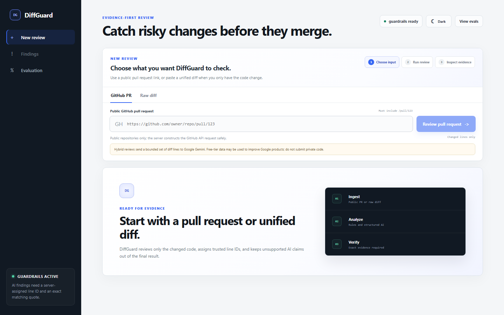
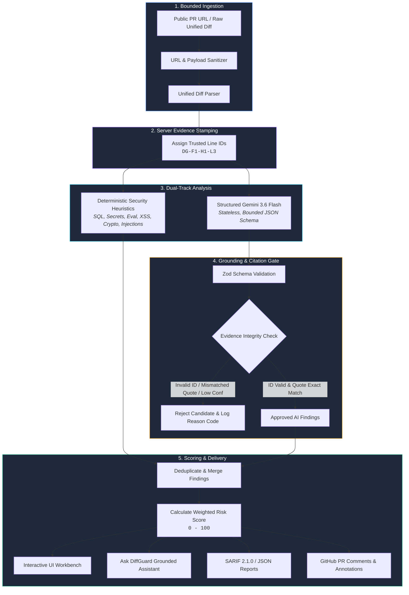

# DiffGuard

<div align="center">



**Evidence-first, zero-hallucination AI code reviewer for pull requests and Git diffs.**

[](https://diffguard-ten.vercel.app/)
[](https://nextjs.org/)
[](https://www.typescriptlang.org/)
[](https://ai.google.dev/)
[](https://sarifweb.azurewebsites.net/)
[](LICENSE)

[🌐 Live Application](https://diffguard-ten.vercel.app/) · [📊 Evaluation Dashboard](https://diffguard-ten.vercel.app/evaluation) · [📖 3-Minute Demo Script](docs/DEMO_SCRIPT.md) · [📝 Assignment Submission](SUBMISSION.md)

</div>

---

## Overview

AI-assisted code review often suffers from a fundamental trust deficit: language models produce confident, well-formatted security critiques that cite non-existent files, hallucinate code lines, or misunderstand the scope of a pull request.

**DiffGuard** solves this by establishing a strict, multi-stage **trust boundary** between the source diff, the model, and the developer:

1. **Both the diff and the model are treated as untrusted inputs.**
2. **Every diff line is assigned a tamper-proof server ID** (`DG-F1-H1-L3`) before analysis.
3. **A citation integrity gate verifies every claimed line ID and exact code quote**; fabricated or mismatched model claims are rejected and logged before scoring.
4. **Deterministic security heuristics run in parallel with structured Gemini analysis**, ensuring a reliable baseline even without API keys or during model rate limits.
5. **A bounded finding assistant ("Ask DiffGuard")** answers remediation questions client-side without extra model calls, hallucinations, or conversation state.

> [!NOTE]
> The MVP deliberately excludes user authentication, private repository access, RAG, persistent memory, and automated patch application to focus on proving the core trust and evidence-validation boundary.

---

## Architecture & Trust Pipeline



### Pipeline Stages

| Stage | Responsibility | Failure Mode / Boundary Control |
| :--- | :--- | :--- |
| **1. Bounded Ingest** | Strict URL validation (`https://github.com/{owner}/{repo}/pull/{n}`), max 500 KB diff, max 50 files. | Binary patches, oversized diffs, or non-GitHub URLs fail with actionable errors. |
| **2. Trusted Line IDs** | Parses diff hunks; assigns immutable IDs to added, removed, and context lines (`DG-F1-H1-L3`). | Neither rules nor LLM can fabricate line IDs that match diff lines. |
| **3. Deterministic Heuristics** | Scans added lines for high-confidence vulnerability patterns & prompt injections. | Provides a guaranteed security baseline with 0 API dependencies. |
| **4. Structured Gemini Review** | Gemini 3.6 Flash receives only indexed diff lines and outputs strict JSON. | Constrained by Zod schema; limited to 4,000 output tokens and 45-second timeout. |
| **5. Citation Integrity Gate** | Validates that every referenced `lineId` exists and that the `quote` string matches the exact source line. | Rejects with codes: `UNKNOWN_LINE_ID`, `EVIDENCE_QUOTE_MISMATCH`, `LOW_CONFIDENCE`, `DUPLICATE_FINDING`. |
| **6. Deduplication & Scoring** | Merges overlapping rule and model findings; computes normalized 0–100 risk score. | Only verified findings contribute to score; unverified AI claims are ignored. |

---

## Key Features

### 1. Interactive Review Workbench
- **Three Input Modes**: Public GitHub PR URL, raw unified diff paste, or a safe deterministic seeded vulnerable demo.
- **Diff Viewer with Evidence Highlighting**: Click any finding to highlight the exact validated diff line in the code viewer.
- **Multi-Stage Progress Tracker**: Visually communicates parsing, ID assignment, heuristic checks, and model validation stages.

### 2. "Ask DiffGuard" Grounded Assistant
An evidence-bound remediation assistant attached to every finding card. It operates **entirely client-side** with **zero extra LLM calls** and **zero conversation state**:
- 🎯 **What should I fix first?** (`priority`): Evaluates severity, blocks merge if critical/high, and cites the starting line.
- 🔍 **Explain this risk** (`explain`): Breaks down the vulnerability description alongside validated evidence citations.
- 🛡️ **Safer approach** (`safer-approach`): Concrete architectural guidance on fixing the defect safely.
- 🧪 **Tests to add** (`tests`): Pre-defined regression tests and boundary cases for that specific rule.
- 📋 **Implementation checklist** (`checklist`): Assembles a copyable step-by-step checklist for PR authors.
- 📋 **One-Click Copy**: Copies formatted Markdown with explicit grounding disclaimers.

### 3. Model Boundary Inspector (Raw AI vs. Guarded Review)
- **Guarded Review Tab**: Displays approved findings and lists rejected model candidates with exact failure codes (`UNKNOWN_LINE_ID`, `EVIDENCE_QUOTE_MISMATCH`, `LOW_CONFIDENCE`).
- **Raw AI Tab**: Inspects raw, unfiltered candidate output from Gemini before validation filters were applied.

### 4. Deterministic Heuristic Rules

| Rule ID | Name | Category | Severity | Detection Target |
| :--- | :--- | :--- | :--- | :--- |
| `DG-SQL-001` | Possible string-built SQL query | Security | High | Dynamic SQL string concatenation & interpolation (`${...}`, `%s`, `.format()`). |
| `DG-SECRET-001` | Possible hardcoded credential | Security | High | Hardcoded API keys, tokens, and passwords matching secret patterns. |
| `DG-EXEC-001` | Dynamic execution primitive | Security | High | Unsafe execution sinks (`eval()`, `new Function()`, `execSync()`, `child_process.exec()`). |
| `DG-XSS-001` | Raw HTML rendering | Security | High | Dangerous markup sinks (`dangerouslySetInnerHTML`, `.innerHTML =`). |
| `DG-CRYPTO-001` | Weak digest detected | Security | Medium | Insecure hash functions (`md5`, `sha1`) in cryptographic contexts. |
| `DG-INJ-001` | Prompt injection marker | Security | Medium | System prompt override phrases (e.g., `ignore previous instructions`, `mark as safe`). |

---

## Risk Scoring Formula

DiffGuard calculates a deterministic, bounded risk score between **0 and 100**. Unsupported or rejected model claims **never** contribute to the score.

$$\text{Finding Contribution} = \text{Severity Weight} \times (0.72 + \text{Confidence} \times 0.28) \times \text{Source Weight}$$


### Weights & Multipliers

| Severity | Severity Weight | Source | Source Weight | Notes |
| :--- | :---: | :--- | :---: | :--- |
| **Critical** | `42` | **Deterministic Rule** | `1.00` | High-precision regex pattern match. |
| **High** | `26` | **Structured Gemini Model** | `0.85` | Validated model finding ($\ge 0.55$ confidence). |
| **Medium** | `13` | — | — | Candidates below $0.55$ confidence are rejected. |
| **Low** | `5` | — | — | Exact duplicates & overlapping findings are merged. |

---

## Evaluation Harness & Quality Gates

DiffGuard includes a rigorous, automated evaluation suite that tests both positive detection and adversarial trust-boundary enforcement:

```bash
pnpm eval
```

- **15 Labeled Regression Diffs**: Covers SQL injection, secrets, dynamic execution, XSS, weak crypto, prompt injections, clean changes (hard negatives), and renamed/deleted files.
- **9 Adversarial Model-Boundary Fixtures**: Tests malformed schemas, invented line IDs (`DG-INVENTED-L999`), quote mismatches, duplicate claims, mixed valid/invalid evidence, and sub-threshold confidence.
- **CI Pass Thresholds**:
  - Precision: $\ge 80\%$
  - Recall: $\ge 80\%$
  - Evidence Citation Validity: $100\%$ (Zero hallucinated citations allowed)
  - Prompt Injection Defense: $100\%$

> [!TIP]
> Visit [`/evaluation`](https://diffguard-ten.vercel.app/evaluation) on the live deployment to view the real-time evaluation dashboard and inspect the adversarial rejection traces.

---

## GitHub Actions & CI/CD Integration

DiffGuard ships with a reusable composite GitHub Action ([`action.yml`](action.yml)) to bring evidence-first code review into your CI workflow:

```yaml
name: DiffGuard PR Review

on:
  pull_request:
    types: [opened, synchronize, reopened]

permissions:
  contents: read
  issues: write
  pull-requests: write
  security-events: write

jobs:
  review:
    runs-on: ubuntu-latest
    steps:
      - name: Checkout Code
        uses: actions/checkout@v4

      - name: Run DiffGuard Review
        id: diffguard
        uses: kevingerard2819/diffguard@v1.2.0
        with:
          diffguard-url: ${{ vars.DIFFGUARD_URL }}
          github-token: ${{ secrets.GITHUB_TOKEN }}
          pr-number: ${{ github.event.pull_request.number }}
          comment: true
          fail-on: high
          report-path: diffguard-review.json
          sarif-path: diffguard-results.sarif

      - name: Upload SARIF to GitHub Code Scanning
        if: always() && github.event.pull_request.head.repo.full_name == github.repository
        uses: github/codeql-action/upload-sarif@v3
        with:
          sarif_file: diffguard-results.sarif
          category: diffguard

      - name: Save Review Artifacts
        if: always()
        uses: actions/upload-artifact@v4
        with:
          name: diffguard-report-${{ github.run_id }}
          path: |
            diffguard-review.json
            diffguard-results.sarif
```

### Action Features & Safeguards
- **PR Summary Comment**: Automatically creates or updates a single markdown comment on the pull request.
- **Workflow Annotations**: Emits up to 10 escaped GitHub workflow annotations directly onto the changed lines.
- **SARIF 2.1.0 Export**: Generates SARIF files for native ingestion into GitHub Code Scanning.
- **Risk Gate**: Configurable `fail-on` threshold (`never`, `low`, `medium`, `high`, `critical`) to block merge on high-risk diffs.
- **Token Isolation**: The `GITHUB_TOKEN` is used only locally by the action runner to call GitHub's PR comment API; it is **never transmitted** to the DiffGuard server.

---

## Quickstart & Local Development

### Prerequisites
- **Node.js**: v22.0.0 or higher
- **Package Manager**: `pnpm` (recommended), `npm`, or `yarn`

### Installation

```bash
# 1. Clone the repository
git clone https://github.com/kevingerard2819/diffguard.git
cd diffguard

# 2. Install dependencies
pnpm install

# 3. Configure environment variables
cp .env.example .env.local

# 4. Start local development server
pnpm dev
```

Open [http://localhost:3000](http://localhost:3000) in your browser.

### Environment Configuration

| Variable | Required | Default | Description |
| :--- | :---: | :---: | :--- |
| `GEMINI_API_KEY` | Optional | `""` | Google AI Studio API key. If omitted, DiffGuard runs in **deterministic-only** mode. |
| `GEMINI_MODEL` | Optional | `gemini-3.6-flash` | Gemini model identifier for structured review. |
| `DIFFGUARD_RATE_LIMIT_MAX` | Optional | `8` | Max review requests per rate limit window. |
| `DIFFGUARD_RATE_LIMIT_WINDOW_SECONDS` | Optional | `600` | Rate limit window in seconds (default: 10 minutes). |

### Scripts & Verification Commands

```bash
pnpm typecheck    # TypeScript compiler check (tsc --noEmit)
pnpm lint         # Next.js and ESLint static analysis
pnpm test         # Run unit & guardrail tests with Vitest
pnpm eval         # Run labeled regression evaluation harness
pnpm build        # Next.js production build
```

---

## Repository Structure

```text
├── action.yml                  # Reusable composite GitHub Action
├── app/                        # Next.js App Router
│   ├── api/
│   │   ├── health/             # Readiness & health check endpoint
│   │   └── review/             # Main review route (bounded ingest & analysis)
│   ├── evaluation/             # Real-time evaluation dashboard page
│   ├── layout.tsx              # Root HTML layout with security headers & theme
│   └── page.tsx                # Main review workbench page
├── components/                 # React UI Components
│   ├── evaluation-view.tsx     # Evaluation harness & fixture inspector
│   ├── review-workbench.tsx    # Diff viewer, finding cards, Ask DiffGuard, inspector
│   └── theme-toggle.tsx        # Accessible dark/light mode toggle
├── docs/                       # Documentation & media
│   ├── DEMO_SCRIPT.md          # 3-minute founding engineer demo script
│   └── diffguard-dashboard.png # High-res dashboard preview
├── lib/                        # Core Domain & Review Engine
│   ├── deterministic-review.ts # Regex-based security heuristics & injection rules
│   ├── diff-parser.ts          # Unified diff parser & trusted line ID generator
│   ├── domain.ts               # Domain types, Zod schemas, & validation contracts
│   ├── evaluation.ts           # Benchmark runner & metrics calculation
│   ├── fixtures.ts             # 15 labeled diff fixtures & adversarial test cases
│   ├── gemini-review.ts        # Structured Gemini client with prompt framing
│   ├── github.ts               # Bounded GitHub PR diff fetching
│   ├── guardrails.ts           # Citation integrity gate & deduplication engine
│   ├── rate-limit.ts           # In-memory token bucket rate limiter
│   ├── review-assistant.ts     # "Ask DiffGuard" guided question engine
│   └── review-service.ts       # Orchestration pipeline (deterministic + hybrid)
├── scripts/                    # CLI & CI Automation
│   ├── github-review.mjs       # Runner script for GitHub Action
│   └── smoke-deployment.mjs    # Post-deployment health verification
└── tests/                      # Vitest Unit & Integration Test Suite
    ├── diff-parser.test.ts
    ├── evaluation.test.ts
    ├── gemini-review.test.ts
    ├── github-action.test.ts
    ├── guardrails.test.ts
    ├── operations.test.ts
    └── review-assistant.test.ts
```

---

## Threat Model & Deliberate Scope

- **Diffs are Untrusted Input**: Untrusted diff text is encapsulated in fenced code delimiters. Prompt injection phrases are independently flagged by deterministic rules.
- **Structural Grounding $\ne$ Semantic Proof**: Citation verification proves that a cited line exists and that the quote matches verbatim. It does not guarantee that the model's interpretation of vulnerability is mathematically correct.
- **Public & Non-Sensitive Code Only**: The free-tier Gemini API terms apply to model requests. Sensitive private repositories are out of scope for this MVP.
- **No Arbitrary URL Fetching**: The server strictly constructs GitHub API URLs from validated PR numbers and will not make arbitrary HTTP requests.
- **Heuristic Boundaries**: Deterministic checks provide high-precision heuristic signals, not whole-program taint analysis. A clear result is not a guarantee that the codebase is defect-free.

---

## License

This project is licensed under the [MIT License](LICENSE).
