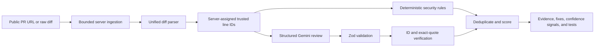

# DiffGuard

DiffGuard is an evidence-first AI code-review prototype for public GitHub pull requests, raw unified diffs, and a safe seeded vulnerable demo. It assigns trusted line IDs on the server, runs repeatable heuristic security checks, optionally adds structured model findings, and rejects model claims that fail its structural-grounding checks.

The MVP intentionally excludes authentication, private repositories, RAG, memory, and model routing.

**[Open the live application](https://diffguard-ten.vercel.app/)** · **[View the evaluation dashboard](https://diffguard-ten.vercel.app/evaluation)** · **[Read the assignment submission](SUBMISSION.md)**


## Why this implementation is defensible



- GitHub input is limited to strict `https://github.com/{owner}/{repo}/pull/{number}` URLs. DiffGuard constructs the API URL itself, uses at most two bounded eight-second attempts for transient failures, and caps text diffs at 500 KB and 50 changed files. Binary patches fail with a clear error.
- Model input is separately capped at 80,000 characters and model output at 4,000 tokens; heuristic checks still evaluate the complete accepted text diff.
- Added, removed, and context lines receive stable IDs such as `DG-F1-H1-L3` before either rules or a model sees them.
- Deterministic heuristics flag potentially unsafe SQL interpolation, committed secrets, dynamic execution, unsafe HTML, weak hashing, and prompt-injection phrases for further review. They do not prove exploitability.
- The optional model call uses Gemini's stateless Interactions API with an explicit JSON schema, low reasoning, no tools, one bounded 45-second attempt, and Zod validation after parsing. A second local guardrail requires every evidence ID to exist and every supplied quote to match the referenced diff line exactly. The integration follows Google's [structured-output guidance](https://ai.google.dev/gemini-api/docs/structured-output).
- Model requests set `store: false`. The Gemini free tier may still use submitted content to improve Google products, so the MVP is limited to public or non-sensitive diffs and surfaces that disclosure in the UI.
- Raw, approved, and rejected structured candidates are preserved with reason codes such as `UNKNOWN_LINE_ID`, `EVIDENCE_QUOTE_MISMATCH`, `LOW_CONFIDENCE`, and `DUPLICATE_FINDING`. The UI exposes both Raw AI and Guarded Review views.
- The finding-level **Ask DiffGuard** assistant answers five guided questions using only the selected validated finding. It makes no extra model call, adds no conversation state, and can copy an evidence-grounded implementation checklist.
- DiffGuard enforces structural grounding: it prevents citations to nonexistent changed lines and mismatched quotes. This does not prove that an approved finding is semantically correct.
- Review responses include a correlation ID and `Server-Timing`; privacy-safe JSON logs record operational counts and failure categories without diff text, URLs, prompts, or model output.
- Public PR and raw-diff requests have a configurable, best-effort per-instance limit. The seeded demo bypasses this limit because it makes no model request.
- `/api/health` reports deterministic and hybrid capability readiness without exposing credentials, while global CSP, frame, MIME, referrer, resource, and permissions headers harden the browser surface.

## Run locally

Requirements: Node.js 22+ and pnpm.

```bash
pnpm install
cp .env.example .env.local
pnpm dev
```

Open `http://localhost:3000`. The seeded demo always works without a key and uses deterministic adversarial candidates. Public-PR and raw-diff reviews run deterministic checks without `GEMINI_API_KEY`; adding a Google AI Studio key enables hybrid analysis with the stable `gemini-3.6-flash` model. `DIFFGUARD_RATE_LIMIT_MAX` and `DIFFGUARD_RATE_LIMIT_WINDOW_SECONDS` configure the public review limit.

## Quality gate

```bash
pnpm typecheck
pnpm lint
pnpm test
pnpm eval
pnpm build
```

The initial evaluation harness contains 15 labeled security, prompt-injection, renamed/deleted-file, and hard-negative diffs plus nine adversarial model-boundary cases. The latter exercise malformed schemas, invented line IDs, quote mismatch, mixed evidence, duplicate output, and low confidence. CI fails if precision or recall drops below 80%, if evidence validity or the prompt-injection fixture pass rate falls below 100%, or if any fixture regresses.

This small, handcrafted corpus is a regression harness—not a benchmark and not evidence of dependable real-world vulnerability detection.

The evaluation page also includes a visible rejection trace for an invented citation (`DG-INVENTED-L999`). It is an adversarial fixture, not a claim that a live model produced that exact value.

## DevOps and GitHub integration

DiffGuard includes a deliberately small operational layer that can be explained and demonstrated:

- `quality.yml` type-checks, lints, tests, reruns the labeled evaluation gate, builds the production application, and retains the evaluation JSON as a 14-day workflow artifact.
- `codeql.yml` scans JavaScript and TypeScript on pushes, pull requests, and a weekly schedule.
- Dependabot groups weekly production, development, and GitHub Actions updates.
- `deployment-smoke.yml` validates the deployed `/api/health` readiness contract after successful GitHub deployments or by manual dispatch.
- The root `action.yml` is a reusable composite action. It sends only a public PR URL to DiffGuard, emits up to ten escaped workflow annotations from final findings, writes the validated result to the GitHub job summary, saves JSON and SARIF reports, optionally upserts one PR comment, and can enforce an explicit risk threshold.

The repository's own `DiffGuard PR review` workflow is manually dispatched with a PR number. It checks out the trusted default branch before running the local action, so pull-request changes cannot replace action code while a write-capable token is present.

After deployment, add an Actions repository variable named `DIFFGUARD_URL` containing the HTTPS Vercel URL. Then run **Actions → DiffGuard PR review → Run workflow** and enter a public PR number.

Other public repositories can consume a tagged release of the action:

```yaml
name: DiffGuard
on:
  pull_request:

permissions:
  contents: read
  issues: write
  pull-requests: write
  security-events: write

jobs:
  review:
    runs-on: ubuntu-latest
    steps:
      - id: diffguard
        uses: kevingerard2819/diffguard@v1.2.0
        with:
          diffguard-url: ${{ vars.DIFFGUARD_URL }}
          github-token: ${{ secrets.GITHUB_TOKEN }}
          pr-number: ${{ github.event.pull_request.number }}
          comment: true
          fail-on: high
          report-path: diffguard-review.json
          sarif-path: diffguard-results.sarif
      - name: Upload DiffGuard SARIF
        if: always() && github.event.pull_request.head.repo.full_name == github.repository
        uses: github/codeql-action/upload-sarif@v4
        with:
          sarif_file: diffguard-results.sarif
          category: diffguard
      - name: Upload DiffGuard evidence report
        if: always()
        uses: actions/upload-artifact@v7
        with:
          name: diffguard-review-${{ github.run_id }}
          path: |
            diffguard-review.json
            diffguard-results.sarif
          if-no-files-found: warn
```

The composite action writes JSON and SARIF reports; the separate upload steps make them available to GitHub Code Scanning and as downloadable workflow artifacts. SARIF upload is skipped for forked pull requests because GitHub restricts their token. Comment failure remains non-fatal: annotations, reports, and the job summary remain available. The GitHub token is used only against GitHub's comment API and is never sent to the DiffGuard deployment.

## Deploy to Vercel

1. Import the repository into Vercel as a Next.js project.
2. Optionally add `GEMINI_API_KEY` and `GEMINI_MODEL=gemini-3.6-flash` in Project Settings > Environment Variables. Rotate any key that has been shared outside the deployment.
3. Set `DIFFGUARD_RATE_LIMIT_MAX=8` and `DIFFGUARD_RATE_LIMIT_WINDOW_SECONDS=600`, then configure provider or edge quotas for multi-instance protection.
4. Deploy, then add the deployment URL as the `DIFFGUARD_URL` Actions repository variable.
5. Run the `Deployment smoke test` workflow once manually. Future Vercel deployment-status events are checked automatically when they include an environment URL.

No database, background worker, or private GitHub credential is required for the MVP.

The review route is configured for the Node.js runtime with a 60-second maximum duration. If no model key is present or a model request fails, deterministic analysis is returned with a visible warning.

## Risk score

The score is a bounded prioritization signal, not the probability that a pull request is vulnerable. Exact duplicates are removed, and overlapping deterministic/model findings with the same category and primary evidence line are merged before scoring.

```text
finding contribution = severity weight × (0.72 + confidence × 0.28) × source weight
risk score = clamp(round(sum(unique contributions)), 0, 100)
```

Severity weights are critical `42`, high `26`, medium `13`, and low `5`. Source weights are deterministic `1.0` and model `0.85`. A deterministic percentage is rule-match confidence, not exploit probability; a model percentage is the model's structured confidence signal. Model candidates below `0.55` confidence are rejected before scoring.

## Threat model and limitations

- Diff text is untrusted data. Prompt-like content is delimited for the model and independently detected by a deterministic guardrail.
- Free-tier Gemini requests must contain only public or non-sensitive code. DiffGuard does not persist submitted source, but Google's free-tier data terms still apply to the bounded lines sent for live review.
- Public GitHub requests are unauthenticated and therefore subject to GitHub rate limits; raw-diff input is the fallback.
- Pattern checks are deliberately precise heuristics rather than exhaustive analysis. A clear result is not a guarantee that code is safe or defect-free.
- DiffGuard's pipeline is language-agnostic for text-based Git diffs, but review coverage is strongest for the languages and vulnerability patterns represented in its deterministic rules and evaluation fixtures. Gemini can review many languages with varying, unguaranteed accuracy; binary files, oversized diffs, and specialized generated formats remain outside the supported boundary.
- Exact citation integrity does not establish semantic correctness; an approved model finding can still misunderstand a real line.
- Adversarial model-boundary fixtures remain isolated to the evaluation page and automated tests; they are never presented as live-model output.
- DiffGuard does not execute submitted code and does not fetch arbitrary URLs.
- The built-in limiter is intentionally best-effort and per server instance; provider quotas or edge enforcement are still required for durable multi-instance protection.
- Real-world expansion should add language-aware data flow, a larger labeled corpus, durable edge rate limiting, deeper observability, and authenticated GitHub App access as separate milestones.

## Interview demo

Use [`docs/DEMO_SCRIPT.md`](docs/DEMO_SCRIPT.md) for a focused three-minute walkthrough covering the product problem, trusted-line boundary, rejection trace, evaluation gate, and deliberate MVP trade-offs.

## License

[MIT](LICENSE)
